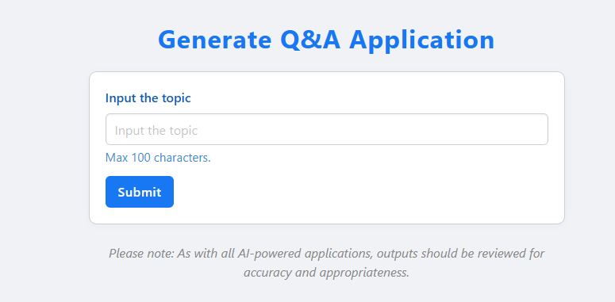
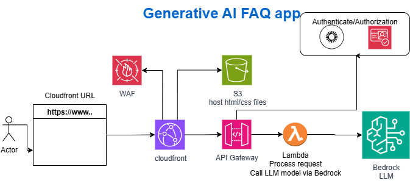

# GenAI Quiz

> Generate topic-based FAQs and quizzes using Generative AI (LLM) on AWS.

## Overview

GenAI Quiz is a serverless application that generates FAQs and quizzes for any topic provided by the user. Leveraging AWS Bedrock's LLM capabilities, it helps users test and expand their knowledge interactively on their favorite subjects.



## Features

- Generate quizzes and FAQs for any topic
- Uses Generative AI (LLM) for question generation
- Serverless, scalable, and cloud-native
- Simple web frontend for quiz interaction

# Starting Point

This is just a starting point; it can be used in schools to create quizzes for students, social apps, career websites, or exam preparation.

## Architecture

The solution is built using AWS Lambda, API Gateway, S3, CloudFront, and Bedrock. Infrastructure is managed via Terraform.



## Technical Stack

- **Python**: 3.10
- **AWS CloudFront**: CDN for serving static content
- **AWS S3**: Storage for static assets and Lambda deployment packages
- **AWS Lambda**: Backend compute for quiz generation
- **AWS Bedrock**: Generative AI model for creating questions
- **AWS WAF**: Web Application Firewall for security
- **Terraform**: Infrastructure as Code

## Deployment

NOTE: This solution is only for development use, for production we need to tighten security. e-g Firewals, IP address restriction or some authorizers.

1. **Package Lambda**: Use the provided script to zip the Lambda code:
   ```sh
   ./create_deployment.sh
   ```
2. **Upload to S3**: The zipped Lambda package is uploaded to the S3 bucket ("lambdas/qa_lambda_deployment_package.zip") specified in your Terraform variables.
3. **Deploy Infrastructure**: Run Terraform to provision all AWS resources:
   ```sh
   terraform init
   terraform plan
   terraform apply
   ```
4. Update the APIGateway URL in /html/multiple-choise/index.html [apiGatewayUrl](output via terraform). Then upload to S3 bucket.

## Usage

1. Access the cloudfront URL, output via terrafrom.
2. Enter your topic and generate a quiz.
3. Answer the questions and check your results.

## Repository

GitHub: [https://github.com/m3dcodie/genai-quiz](https://github.com/m3dcodie/genai-quiz)

## Roadmap

CI/CD
Lambda deployement improvement
Can restrict APIGateway to only call via Cloudfront. or make APIgateway private and use VPC endpoints for access.
Remote terraform state
WAF with AWS managed rules

## License

This project is licensed under the MIT License. You are free to fork and modify the code, but **attribution to the original author is required** in your derived works.

---

**Author:** Suhail T
